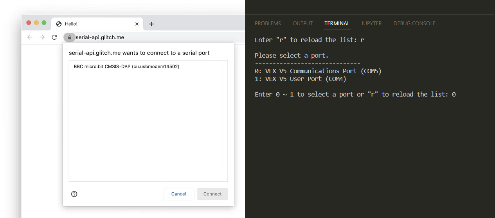

[](https://codecov.io/gh/Jerrylum/node-web-serial-ponyfill)   

An implementation of the Serial API on top of the Node.js serialport package.

<br/>

# What is this?

For example, you wrote a program that connect to a device through Web Serial API.

```js
(async function () {
    let filters = [{ usbVendorId: 10376 }];

    let port = await navigator.serial.requestPort({ filters });

    await port.open({ baudRate: 115200 });

    let reader = port.readable.getReader();
    let writer = port.writable.getWriter();

    await writer.write(Uint8Array.from([201, 54, 184, 71, 86, 34, 0, 96, 252]));

    ...

    await reader.cancel();
    await writer.close();
    await port.close();
})();
```

It works on the browser. Now, you want to do the same things in the Node.js environment. However, Web Serial API is not supported in Node.js. You need to install a package called `serialport` and you won't be able to reuse the code since the API is different.

<br/>

With this library, you can write a program that works on both browser and Node.js environment. All you need to do is import this package and change a few lines of code:

```diff
+ import { serial } from "node-web-serial-ponyfill";

(async function () {
    let filters = [{ usbVendorId: 10376 }];

-   let port = await navigator.serial.requestPort({ filters });
+   let port = await serial.requestPort({ filters });

    await port.open({ baudRate: 115200 });

    ...
})();
```

By doing this, you can now connect to a device in a Node.js program without changing the code.


# But wait, what about the user interface?

Good question! The user interface is the same as the browser. If you ask the user to select a serial port, they will be able to select one from the console.




# More features:

In addition, you can still do everything you can do in Node.js. For example, you can connect to a serial port by providing the path name. So we provide you the `findPort` method which will return the port that matches the given path name. It's specific to Node.js and you can't do it in the browser. Here is the type definition of this package.

```ts
interface NodeSerial extends Serial {
    /**
     * Returns all serial ports connected to the host filtered by the options.
     */
    listPorts(options?: SerialPortRequestOptions): Promise<SerialPort[]>;
    
    /**
     * Returns a SerialPort on the path.
     */
    findPort(portPath: string): Promise<SerialPort | undefined>;
    
    ...
}

...

declare const serial: NodeSerial;
```


# Differences:

- Events `connect` and `disconnect` are not implemented.
- Events `open` and `close` are implemented in the serial port class.
- A serial port can be closed without releasing the readable and writable streams.


# Development

Remember to install the following package:

```sh
npm install -g win-node-env
```

Good Luck!